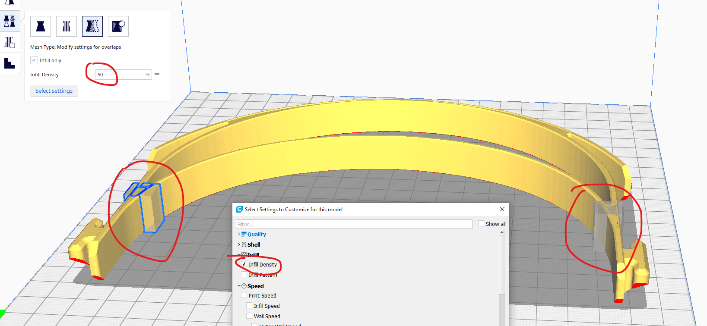
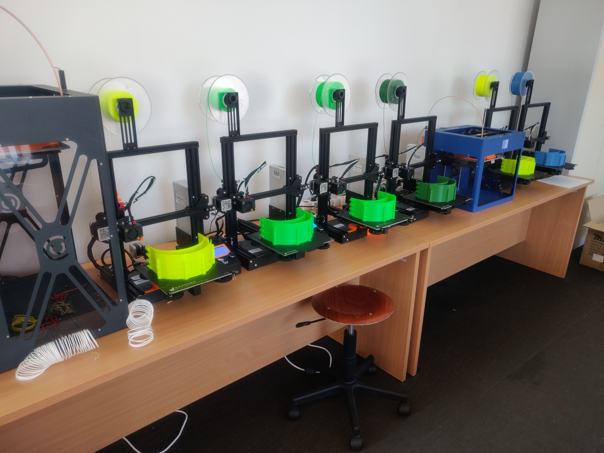
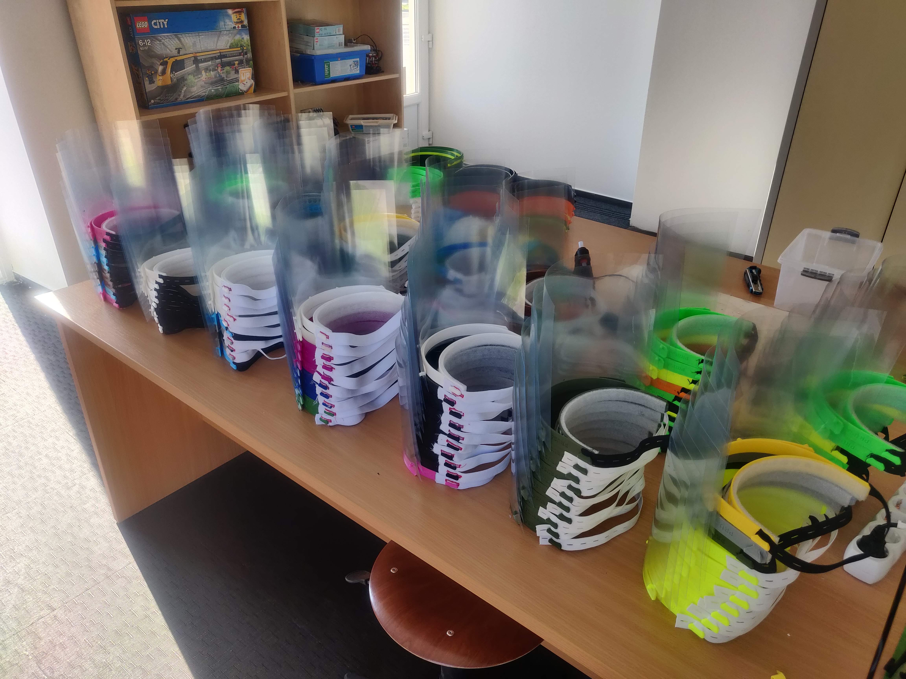

# 3D nyomtatással a koronavírus ellen

## Eredeti modell

Az eredeti modellt a Josef Prusa neve által fémjelzett cég készítette: [https://www.prusa3d.com/covid19/](https://www.prusa3d.com/covid19/)

A modell licensze [Creative Commons 4.0](https://creativecommons.org/licenses/by-nc/4.0/) melyet a lenti fájlok is alkalmaznak. Röviden dióhéjban: osztani ér, módosítani ér, pénzért árulni nem.

Az eredeti modellhez képest szerettem volna pár változtatást eszközölni és nem találtam olyan elérhető modellt ami mindenben megfelelt volna, ezért Fusion 360-ban megcsináltam és az oldal alján minden fájlt elérhetővé teszek hátha másnak is hasznos.

## Változtatások az eredeti modellhez képest

- alacsonyabb magasság (20mm helyett 15mm)
  - gyorsabb nyomtatás, kevesebb anyagigény
- optimalizálás 0.3mm layer height-ra (0.25mm helyett)
  - az eredeti 0.25mm-re volt optimalizálva, de 0.4mm-es nozzle-el még lehet 0.3mm rétegvastagságot is nyomtatni ami gyorsabb
  - emellett a torony esetében a két darab közötti távolság is 0.25mm-re volt állítva és a support-ok alátámasztása is 0.25mm egész többszöröse volt, ezek mind át lettek alakítva 0.3-as rétegvastagsághoz
- feliratok eltávoltása
  - szeretjük Prusát, de a feliratok lassítják a nyomtatást
- több távtartó pont a két darab között 
  - ez tornyok esetében érvényes és a könnyebb szétválasztást segíti elő
- flexi tartó pöckökhöz szükséges support torony tárgytól való távolsága minimálisan növelve
  - erre azért volt szükség, hogy a magasabb line width miatt ne olvadjon össze a support a tárggyal
- 1 és 4 darabos modell mellett 2 és 6 darabos is elérhető
  - többféle modell az idő hatékonyabb kihasználását teszi lehetővé

## Javasolt szeletelő beállítások a sebesség növelésének érdekében

Cura 4.5 szeletelőt használok, így a lenti leírás erre vonatkozik. A legtöbb beállítás megtalálható más szeletelőkben is, esetlegesen más néven. Az stl fájlok mellett 3mf fájlokat is megosztok amik már tartalmazzák a fontosabb beállításokat ugyanakkor ezt érdemes körültekintéssel használni ugyanis tartalmazhat csak az én nyomtatómra érvényes beállításokat is (pl Layer start point nálam 220/220).

Beállítások:
- Quality:
  - layer height: 0.3
  - line width: 0.6 (0.4-es nozzle-is lehet 0.6-ost nyomtatni. Ha ez mégse lehetséges, akkor line width 0.4 és wall thickness 0.8)
- Shell:
  - wall thickness: 0.6
  - top/bottom pattern: concentric
  - optimize wall printing order: be
  - print thin walls: be
  - Z seam alignment: sharpest corner
- Infill:
  - infill density: 10%
  - infill pattern: lines
- Material:
  - printing temperature: ha megszokottnál nagyon sebességgel szeretnénk nyomtatni érdemes a hőfököt is fentebb venni. Én általában a filamentem gyártója által ajánlott tartomány alsó felében szoktam nyomtatni (esetemben 190C), viszont itt a nagyobb sebesség eléréséhez 205C-210C-vel nyomtattam
- Speed:
  - print speed: nyomtatónként változhat. Nekem Ender-5-ön 90mm/s ami még zavaró minőségromlás nélküli nyomtatást eredményez. Ender-3-on 100mm/s-t is érdemes kipróbálni
- Support:
  - generate support: ki
- Build Plate Adhesion:
  - build plate adhesion: brim-et nem javaslom, elég időigényes az eltávolítása. Vagy skirt vagy none
- Experimental:
  - infill travel optimization: be

Mivel az infill 10% viszonylag alacsony, ezért megerősítés céljából két ponton megnövelt infill-t használtam, amit a support blocker-ek elhelyezésével lehet elérni Cura-ban, majd a "Modify settings for overlaps" opció használatával megnövelni 50%-ra az infill-t azon a területen. A csatolt .3mf fájlok ezt már tartalmazzák. 

Amennyiben a szeletelő nem támogat ilyen funkciót, úgy ennek hiányában inkább a 30%-os infill-t javaslom mindenhol.

A fenti beállításokkal 1 óra 30 perc alatti idő elérhető még 90mm/s-el is darabonként.

## Modell fájlok

Fusion 360 és .step fájlok:
- [RC3_mini_remix.f3d](3d_models/RC3_mini_remix.f3d)
- [RC3_mini_remix.step](3d_models/RC3_mini_remix.step)

1 darabos modell:
- [RC3-mini-remix.stl](3d_models/RC3-mini-remix.stl)
- [RC3-mini-remix.3mf](3d_models/RC3-mini-remix.3mf)

2 darabos torony:
- [RC3-mini-remix-stack2.stl](3d_models/RC3-mini-remix-stack2.stl)
- [RC3-mini-remix-stack2.3mf](3d_models/RC3-mini-remix-stack2.3mf)

4 darabos torony:
- [RC3-mini-remix-stack4.stl](3d_models/RC3-mini-remix-stack4.stl)
- [RC3-mini-remix-stack4.3mf](3d_models/RC3-mini-remix-stack4.3mf)

6 darabos torony:
- [RC3-mini-remix-stack6.stl](3d_models/RC3-mini-remix-stack6.stl)
- [RC3-mini-remix-stack6.3mf](3d_models/RC3-mini-remix-stack6.3mf)

## Képek

